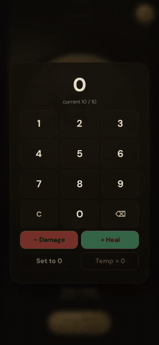
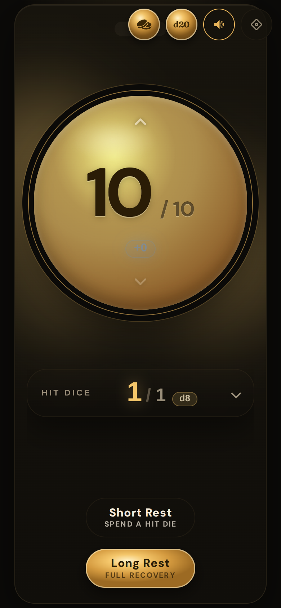
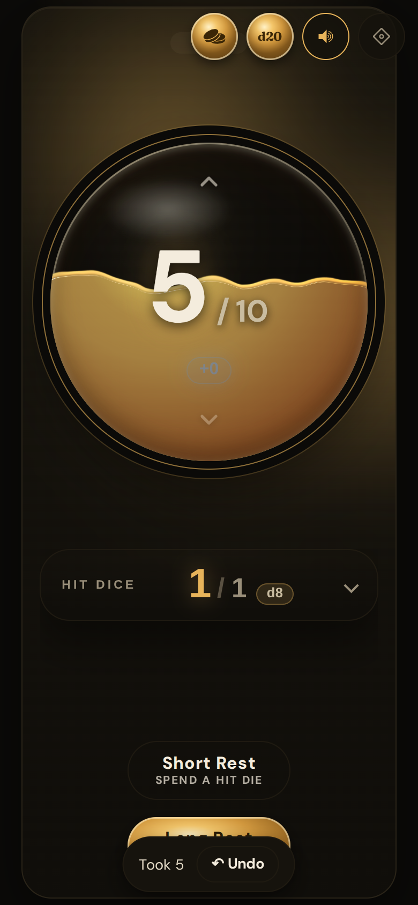
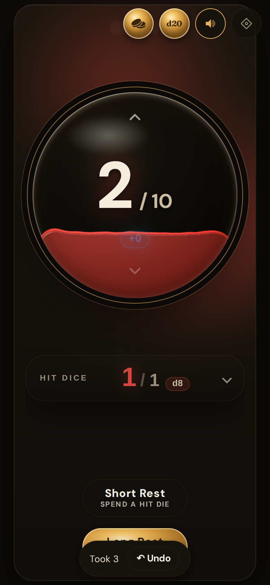
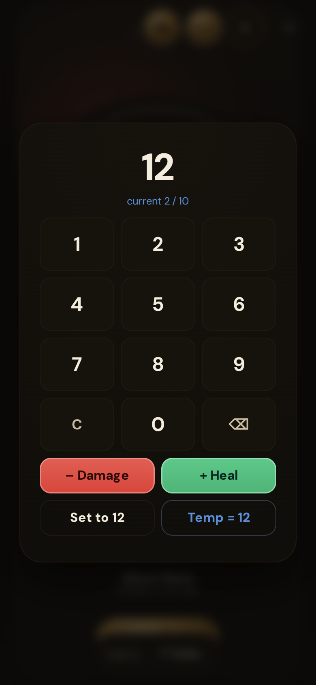
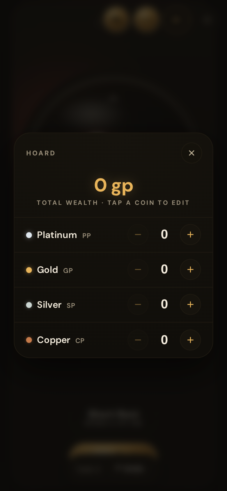
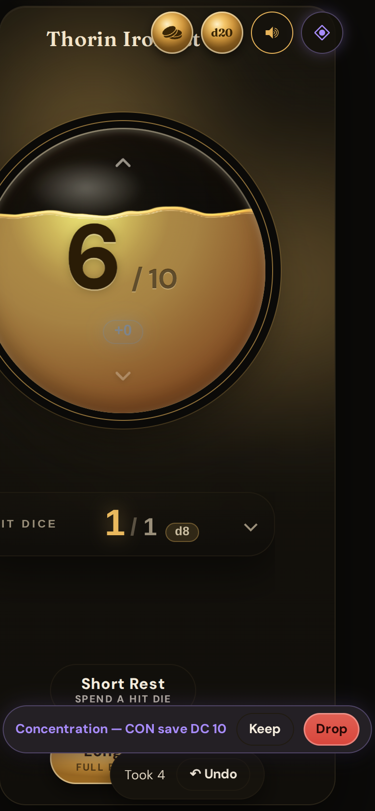

# Hoard HP Tracker

### ▶ **[Open the live app →](https://joshuafuller.github.io/hoard-hp-tracker/)**

Installable PWA — open it on your phone and tap **Add to Home Screen** to use it offline at the table.

> 🧪 **Beta:** work-in-progress builds from the `beta` branch deploy to
> **[/beta/](https://joshuafuller.github.io/hoard-hp-tracker/beta/)** — production above is never affected.

**A gorgeous, fullscreen, mobile-first HP tracker for tabletop games — installable, offline, and
self-hostable.** Original open-source code; ships no game content.

Track current / max / temporary hit points with big thumb-reach **−/+** controls, plus death saves,
short/long rest with Hit Dice, a tap-to-edit pill, satisfying haptics, and optional sound. Runs as an
installable PWA (works offline at the table) or a one-command Docker container.

## Screenshots

<p align="center">
  
</p>

<p align="center">
  
  
  
</p>
<p align="center">
  
  
  
</p>

<sub>Mobile viewport (390×844). Regenerate after a UI change: build + preview, then run the capture script —
<code>pnpm build && pnpm preview --port 4173 &</code> then <code>node scripts/capture-screenshots.mjs</code> (writes <code>docs/screenshots/</code>; needs <code>ffmpeg</code> for the GIF).</sub>

## Features

- **HP at a glance** — luminous readout, a tiered bar (green → amber → red) with a temp-HP overshield.
- **Death saves** — three success / three failure pips and a d20 roll; revive / stabilize / dead.
- **Rests** — spend Hit Dice on a short rest; full recovery on a long rest (with a CON modifier).
- **Tap to set** — tap any value for a pill editor: `−` · type · `+`.
- **Feel** — haptics on supported devices, optional sound effects (mutable).
- **Offline-first PWA** — installable; works with no connection. Your data stays on your device.

## Run it

**Dev**

```bash
pnpm install
pnpm dev            # http://localhost:5173
```

**Quality gates** (test-driven; every change ships with tests)

```bash
pnpm test           # Vitest
pnpm typecheck      # tsc --noEmit (strict)
pnpm lint           # eslint
pnpm build          # tsc + vite build (emits the PWA service worker)
```

**Self-host with Docker**

```bash
docker build -t hoard-hp .
docker run -p 8080:8080 hoard-hp      # http://localhost:8080
# or: docker compose up --build
```

## Tech

React 19 + Vite + TypeScript (strict) + Vitest, `vite-plugin-pwa` (Workbox) for offline/install, and
Dexie (IndexedDB) for local persistence. The HP rules live in a small **pure, fully-tested domain
core** (`src/domain/`); the UI is presentational.

## Quality

The rules domain is held to a high bar: **example + property-based tests** (fast-check) for its
invariants, and **mutation testing** (Stryker) over the domain — CI **fails the build below a 90%
mutation score**, so injected faults must be caught by a test. CI enforces lint, types, tests,
build, and the mutation threshold.

```bash
pnpm mutation        # Stryker mutation testing over src/domain
```

## Product direction

Hoard is **a single player's utility belt at the tabletop** — fast, offline, one-screen tools for
the bookkeeping a player does on their turn (HP, coins, and more to come). What belongs in the app
(and what deliberately doesn't) is governed by an explicit **Scope-Fit Test**. See the
**[Product Requirements Document](docs/PRD.md)** for the vision, personas, and how scope grows.

## License

[AGPL-3.0](LICENSE). See [`NOTICE`](NOTICE). This is an independent, unofficial fan tool and ships no
third-party game content.
