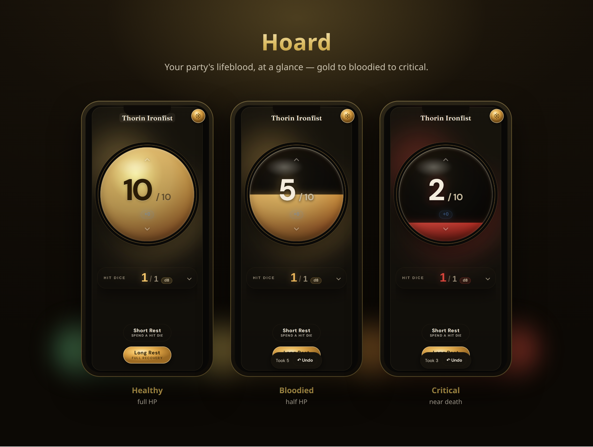
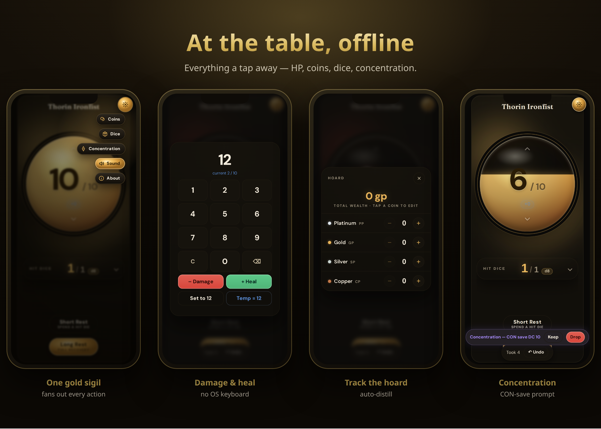

# Hoard

### ▶ **[Open the live app →](https://joshuafuller.github.io/hoard-hp-tracker/)**

*Installable PWA — open it on your phone, tap **Add to Home Screen**, and it works **offline at the table**.*

<p align="center">
  
</p>

**A gorgeous, offline, single-player HP tracker for tabletop games.** A luminous liquid orb for hit
points, plus coins, a 3D dice tray, death saves, and rests — fast one-screen tools for the
bookkeeping you do on your turn. No account, no connection; your data stays on your device.

<p align="center">
  
</p>

## What you get

- **HP at a glance** — a liquid orb that drains gold → bloodied → critical; tap to open the keypad or
  drag the orb up/down to heal/damage, with one-tap undo.
- **Coins** — track the hoard across pp/gp/sp/cp with quick steppers and one-tap **auto-distill**.
- **Dice** — a 3D physics tray for ad-hoc rolls, death-save d20s, and Hit Dice; advantage, modifiers,
  exploding/keep-drop notation, and a roll log.
- **Death saves & rests** — success/failure pips + a d20; **short rest** spends Hit Dice, **long rest**
  restores to full.
- **Concentration** — a CON-save prompt when you take damage while concentrating.
- **One gold sigil** — the radial action hub fans out coins, dice, concentration, sound, and about, so
  the screen stays calm.
- **Feel** — a cohesive synth sound palette + haptics, both optional and mutable.
- **Offline-first PWA** — installable; works with no connection.

## Use it

- **Just play it** — [open the app](https://joshuafuller.github.io/hoard-hp-tracker/), then **Add to
  Home Screen** on your phone for a fullscreen, offline app.
- **Beta builds** — work-in-progress from the `beta` branch deploys to
  **[/beta/](https://joshuafuller.github.io/hoard-hp-tracker/beta/)** (production above is never affected).

It's free, open source, and ships **no game content** — an independent, unofficial fan tool.

---

## Build & self-host

For developers. Players don't need any of this — just the link above.

```bash
pnpm install
pnpm dev            # http://localhost:5173
```

**Self-host with Docker**

```bash
docker build -t hoard-hp .
docker run -p 8080:8080 hoard-hp      # http://localhost:8080
# or: docker compose up --build
```

**Quality gates** (test-driven; every change ships with tests)

```bash
pnpm test           # Vitest
pnpm typecheck      # tsc --noEmit (strict)
pnpm lint           # eslint
pnpm build          # tsc + vite build (emits the PWA service worker)
pnpm mutation       # Stryker mutation testing over src/domain
```

## Tech & quality

React 19 + Vite + TypeScript (strict) + Vitest, `vite-plugin-pwa` (Workbox) for offline/install, and
Dexie (IndexedDB) for local persistence. The HP rules live in a small **pure, fully-tested domain
core** (`src/domain/`); the UI is presentational. The domain is held to a high bar — **example +
property-based tests** (fast-check) and **mutation testing** (Stryker), with CI failing the build
below a 90% mutation score.

## Product direction

Hoard is **a single player's utility belt at the tabletop** — fast, offline, one-screen tools for the
bookkeeping a player does on their turn. What belongs in the app (and what deliberately doesn't) is
governed by an explicit **Scope-Fit Test**. See the
**[Product Requirements Document](docs/PRD.md)** for the vision, personas, and how scope grows.

## License

[AGPL-3.0](LICENSE). See [`NOTICE`](NOTICE). This is an independent, unofficial fan tool and ships no
third-party game content.

---

<details>
<summary><b>Regenerate the screenshot gallery</b></summary>

The branded gallery is generated from the live app — no manual editing:

```bash
pnpm build
pnpm preview --port 4173 &                 # background the preview only
node scripts/capture-screenshots.mjs       # → docs/screenshots/*.png (+ a slosh GIF; needs ffmpeg)
node scripts/compose-gallery.mjs           # → docs/gallery/hero.png + features.png
```

`capture-screenshots.mjs` drives the production build in a 390×844 mobile viewport (fresh profile →
deterministic 10/10 seed, a sample character name, the orb tiers, keypad, coins, the radial hub, and
the concentration prompt). `compose-gallery.mjs` composites those into the device-framed, captioned
Molten Hoard gallery.
</details>
